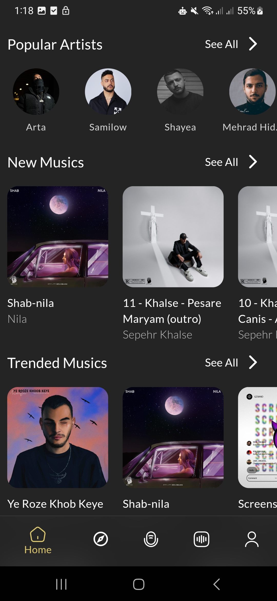

## BongMusic - A Feature-Rich Music Player

BongMusic is a beautifully crafted, high-performance music player application built with Flutter. It offers a seamless and engaging user experience for enjoying your favorite music, both online and offline.

## ✨ Key Features

- **Cross-Platform:** Single codebase for both Android and iOS, thanks to Flutter.
- **Rich Audio & Video Playback:** Supports various audio formats with background playback capabilities powered by `just_audio` and `audio_service`.
- **Offline Storage:** Save your favorite tracks and playlists for offline listening using the high-performance `Hive` database.
- **Stunning & Animated UI:** A visually appealing and responsive interface built with a host of animation and UI libraries.
- **State Management with BLoC:** Predictable and scalable state management using the BLoC (Business Logic Component) pattern.
- **Push Notifications:** Stay updated with Firebase-powered push notifications.
- **Feature-Driven Architecture:** A clean and maintainable codebase organized by application features.
- **Advanced Features:** Includes functionalities like palette generation from album art, cached network images for performance, and more.

## 🏗️ Architecture

The application follows a **feature-driven architecture**, which keeps the codebase organized, scalable, and easy to maintain. The core business logic is decoupled from the UI using the **BLoC pattern** for state management.

- **`lib/features`**: Contains the primary application features (e.g., player, playlists, search).
- **`lib/common`**: Holds shared widgets, constants, and utilities used across multiple features.
- **`lib/config`**: Manages application-level configurations like routing (`go_router`) and themes.
- **`lib/main.dart`**: The entry point of the application, responsible for initializing services and setting up the root widget.

Dependency injection is handled by `get_it`, which provides a clean way to access services and BLoCs throughout the app.

## 🛠️ Tools & Technologies

- **Framework:** [Flutter](https://flutter.dev/)
- **State Management:** [flutter_bloc](https://pub.dev/packages/flutter_bloc)
- **Routing:** [go_router](https://pub.dev/packages/go_router)
- **Audio:** [just_audio](https://pub.dev/packages/just_audio), [audio_service](https://pub.dev/packages/audio_service)
- **Database:** [Hive](https://pub.dev/packages/hive)
- **Networking:** [http](https://pub.dev/packages/http), [cached_network_image](https://pub.dev/packages/cached_network_image)
- **Push Notifications:** [Firebase Messaging](https://pub.dev/packages/firebase_messaging)
- **Dependency Injection:** [get_it](https://pub.dev/packages/get_it)
- **Functional Programming:** [fpdart](https://pub.dev/packages/fpdart)

## 📸 Screenshots

| | | |
|:-------------------------:|:-------------------------:|:-------------------------:|
|  |  |  |
|  |  |  |
|  |  |  |
|  |  |  |
|  |  |  |
|  |  |  |

